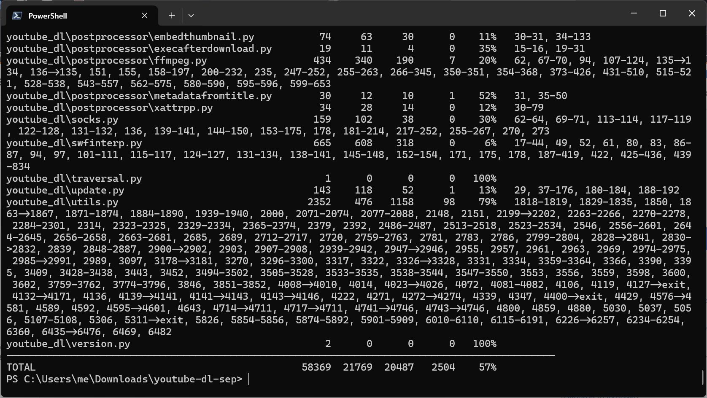
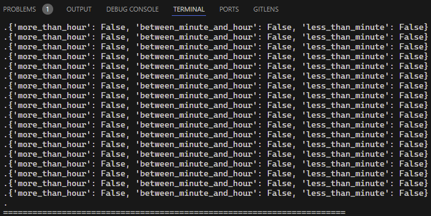
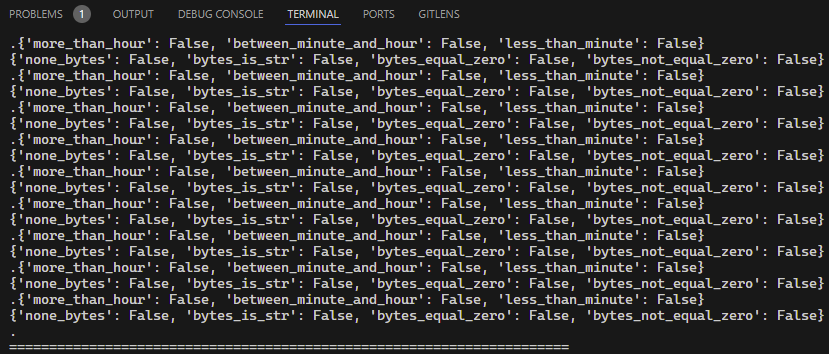
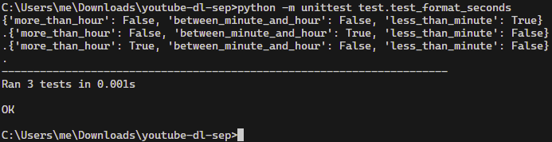
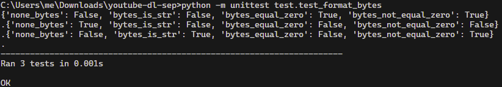
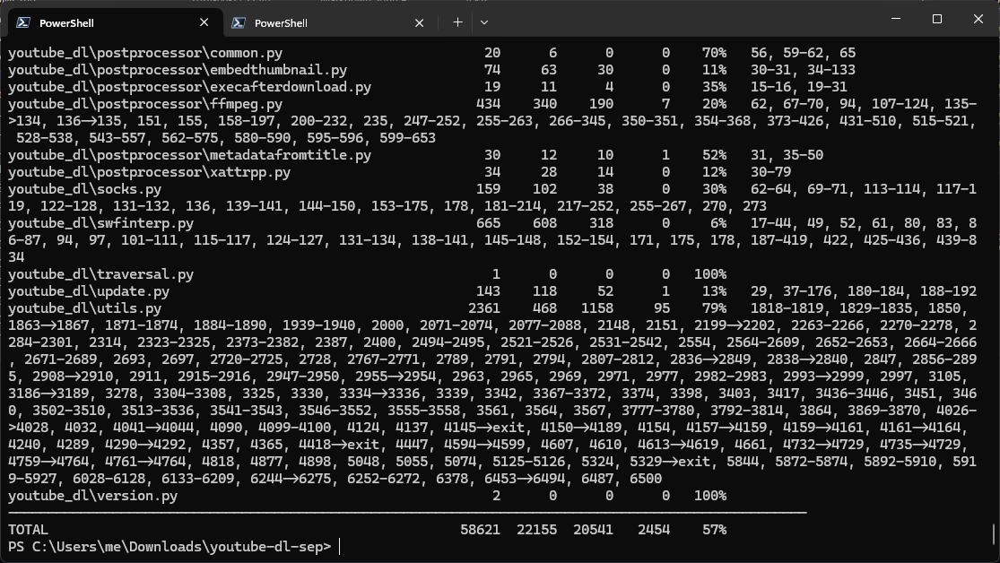

# Report for Assignment 1

## Project chosen

Name: youtube-dl

URL: (https://github.com/ytdl-org/youtube-dl)

Number of lines of code and the tool used to count it: 142,738 LOC reported by `lizard`

Programming language: Python

## Coverage measurement

### Existing tool

`coverage.py` was used to check existing coverage. The command run was `coverage run --branch -m unittest discover`.

### Your own coverage tool

<The following is supposed to be repeated for each group member>

#### Jordan Smith

**Function 1: formatSeconds**

[Instrumentation](https://github.com/rubellyte/youtube-dl-sep/commit/c11880381c947136ba251914cf5b943dfa331675)

Result from existing tests:

**Function 2: format_bytes**

[Instrumentation](https://github.com/rubellyte/youtube-dl-sep/commit/9a24bc632543ca3642759776b3113a0989fccc6a)

Result from existing tests:

#### Nikitas Konstantopoulos

**Function 1: get_base_url**

[Instrumentation](https://github.com/rubellyte/youtube-dl-sep/commit/fe2c02649b2105fcf4fe2cfa45de8182aa6f23e4)

Old Coverage Results:

**Function 2: get_suitable_downloader**

[Instrumentation](https://github.com/rubellyte/youtube-dl-sep/commit/fe2c02649b2105fcf4fe2cfa45de8182aa6f23e4)

#### Matei Mahu

**Function 1: extract_selected_tab**
[Instrumentation](https://github.com/rubellyte/youtube-dl-sep/blob/master/test/test_extract_selected_tab.py)

**Function 2: extract_uploader**
[Instrumentation](https://github.com/rubellyte/youtube-dl-sep/blob/master/test/test_extract_uploader.py)

## Coverage improvement

### Individual tests

<The following is supposed to be repeated for each group member>

#### Jordan Smith

**Test 1: TestFormatSeconds**

[New tests](https://github.com/rubellyte/youtube-dl-sep/commit/2a1cfe97089a3b40f4b36de4784cba7fcf5add2a)

Before:

After:

**Test 2: TestFormatBytes**

[New tests](https://github.com/rubellyte/youtube-dl-sep/commit/f9d8f719a5c0a8c13c8a63223d5db1d28681628d)

Before:

After:

#### Nikitas Konstantopoulos

**Test 1: test_get_base_url**

[New/enhanced test](https://github.com/rubellyte/youtube-dl-sep/commit/4608aad7a7522b296174b4c56d66adfac6fc20ee)

Old Coverage Results:

New Coverage Results:

**Test 2: test_get_suitable_downloader**

[New/enhanced test](https://github.com/rubellyte/youtube-dl-sep/commit/4608aad7a7522b296174b4c56d66adfac6fc20ee)

#### Matei Mahu

**Test 1: test_extract_uploader**
[New test](https://github.com/rubellyte/youtube-dl-sep/blob/master/Results%20of%20coverage%20test%20of%20extract%20uploader)

**Test 2: test_extract_selected_tab**
[New test](https://github.com/rubellyte/youtube-dl-sep/blob/master/Results%20of%20extract%20uploader)
## Coverage improvement

### Overall

Before:

After:

## Statement of individual contributions

Jordan Smith: Instrumented and wrote tests for formatSeconds and format_bytes

Nikitas Konstantopoulos: Instrumented the get_suitable_downloader function and created a test for it(improved coverage for the function) and Instrumented the get_base_url function and created a test for it (improved coverage for the function) 

Matei Mahu:Instrumented and made test for extract uploader and extract selected tab
